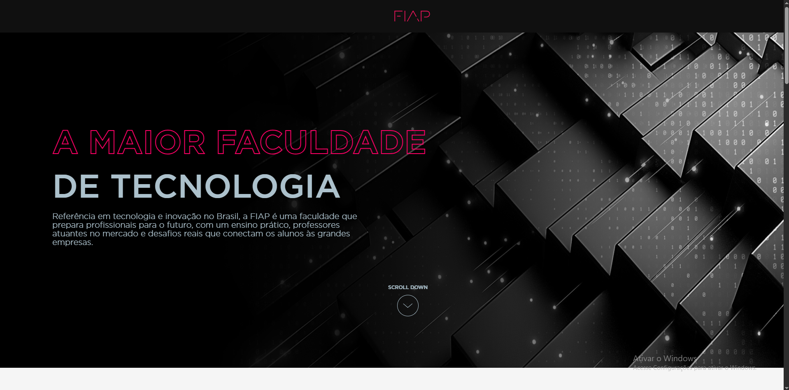

# FIAP - Prova



*Figura 1: Captura de tela do projeto*

## Sobre o Projeto
Página institucional moderno para a FIAP, desenvolvido como desafio tecnico.
- Animações fluidas em CSS/JS
- Efeitos visuais interativos
- Adaptável para mobile

## Tecnologias Utilizadas
### Frontend
| Tecnologia | Uso |
|------------|-----|
| HTML5 | Estrutura semântica |
| CSS3 | Estilização com variáveis e animações |
| JavaScript | Interatividade e efeitos dinâmicos |

### Recursos Especiais


 - Barra de progresso de leitura

 - Scroll down/up

 - Modal interativo

 - Efeito Parallax

 - Transições suaves entre seções

 ## Resolução de Desenvolvimento
Resolução Base (Desktop)

Resolução Ideal para Visualização
- Desktop: 1920x1080

 - Mobile: 412x915 (iPhone XR/11) — conforme ajustado no seu @media (max-width: 412px).

## Como Executar o Projeto

### Método 1: Servidor Local (Recomendado)
```bash
git clone https://github.com/RaphaelSF11/Prova-fiap.git
npm install -g live-server
live-server
```
### Método 2: Abrir Diretamente

1. Baixe os arquivos  
2. Abra o arquivo `index.html` no navegador  

> ⚠️ **Nota**: Algumas animações podem não funcionar sem servidor local devido a políticas de segurança dos navegadores.


### Estrutura de Arquivos

```plaintext
Prova-fiap/
├── assets/
│   ├── fonts/
│   ├── imgs/
│   └── svg/
├── style.css
├── script.js
├── index.html
└── README.md
```
### Destaques Técnicos  
**Design System**  
`css :root { --cor-magenta: #ED145B; --fonte-titulo: "gotham-medium"; }`  

**Responsividade**  
`css @media (max-width: 412px) { .container_titulo { font-size: 40px; } }`